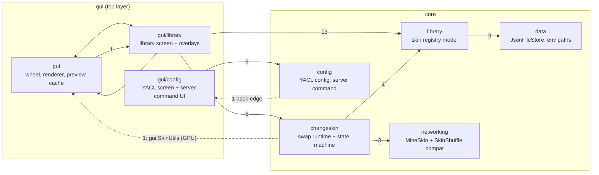
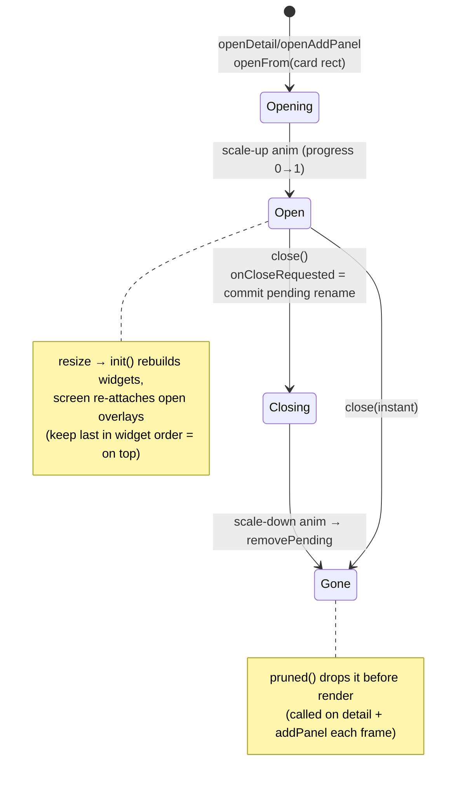

# Code Atlas

> **As of** 2026-09-26, after `extract-library-engines`, version key `26.3` active.
> Regenerate: agent session over the source (imports, `grep -c "//? if"`, `scripts/hotspots.sh`).
> Workflow notes in `DEV.md` — Atlas. Diagrams are Mermaid: rendered on GitHub, readable as text.

Simple Skin Swapper: client-side Fabric mod, single Kotlin source tree compiled to four
Stonecutter targets (`1.21.11`, `26.1.2`, `26.2`, `26.3`). ~7 400 lines + 5 Java mixins.

---

## 1. Package map

Edges below are real `import` counts (root-package helpers `PlayerMessaging.kt`,
`SimpleSkinSwapperClient.kt` folded into `(root)`). Arrow weight = number of distinct imports.



Read of the layering:

- `gui/library → library → data` is the clean spine: screen over registry model over JSON stores.
- **Remaining back-edge** (the only one, by design after `layering-cleanup`):
  - `changeskin → gui` ×1: `StartupSkinSync` uses `gui.SkinUtils` — GPU texture upload
    (`Minecraft`, `DynamicTexture`, `NativeImage`). Splitting its domain half from the
    rendering half is a recorded future candidate (§5 #5).
- Resolved by `layering-cleanup` (2026-09-26): `SkinType` moved to the root package
  (was the cause of four back-edges), `LibraryFacades` (`LibraryServices`, `SkinRecords`,
  `SkinLifecycle`) and `SkinCategoryPalette` moved to `library` (were core wiring consumed
  by `changeskin` from under the GUI package). The Konsist layering rules enforce the map.
- Entry points: keybinds in `SimpleSkinSwapperClient` (library screen, wheel), mixins add menu
  buttons (`MixinTitleScreen`, `MixinGameMenuScreen`), ModMenu/YACL for config. Mixins:
  `MixinPlayer`, `AbstractClientPlayerAccessor`, `MixinClientPlayNetworkHandler`.

---

## 2. Data flows

Persistence is uniform: every store is a `JsonFileStore<T>` (kotlinx.serialization, pretty
print, **fresh object on missing/corrupt** — hand-editable files must never crash the client)
with a load-mutate-save rhythm. Production instances are wired once in `LibraryServices`
(`library/LibraryFacades.kt`) — two registries would diverge and overwrite each other.

```mermaid
flowchart TB
    subgraph disk["skins/ folder"]
        pngs["texture PNGs<br/>hash-named (registry) + originals"]
        selected["selected.json"]
        stores["store JSONs<br/>(registry, cards/categories)"]
    end
    watcher["LibraryFileWatcher<br/>polls external changes,<br/>self-writes grace window"] --> pngs
    pngs --> registry["SkinRegistry<br/>skin = textureHash+model,<br/>identity '<hash>_<model>'"]
    registry --> cards["SkinCardStore<br/>categories -> card references"]
    cards --> guiCats["SkinCategories<br/>(GUI singleton over store)"]
    lifecycle["TextureLifecycle<br/>write on accept, delete<br/>when last reference goes"] --> pngs
    migrator["LibraryMigrator<br/>(one-shot legacy -> registry)"] --> pngs
    fetch["AccountSkinFetcher<br/>Mojang by username"] --> pngs
    changeskin2["SkinChangeManager<br/>state machine (READY_FOR_SWAP...)"] --> selected
    startup["StartupSkinSync<br/>session profile at boot"] --> selected
    uploader["MineSkinUploader<br/>FROZEN wire contract:<br/>{type:file,model} + binary frame"] --> api["MineSkin API"]
    cache["MineSkinCache"] --> uploader
    shuffle["SkinShuffleCompat<br/>skinshuffle:skin_refresh<br/>StreamCodec (FROZEN)"] <->|"payloads"| server["game server"]
    handshake["HandshakePayload<br/>plugin presence"] <-> server
```

Frozen contracts (never refactor/re-encode, see review checklist): `MineSkinUploader`'s
outbound message and the `skinshuffle:skin_refresh` StreamCodec. Inbound parsing may use
typed DTOs.

---

## 3. Screen logic

### Library screen (`SkinLibraryScreen`, 1 306 lines — the hot spot)

Tabs + category band + card grid + full-screen overlays, one screen. Delegated engines:
`TabStripController` (tab press/drag/scroll/reorder + insertion line), `CategoryBand`,
`CardDragEngine` (card drag reorder, eased slots, insertion index), `OverlayManager`
(overlay lifecycle: open/re-attach/raise/prune + overlay input contracts) and `GridEngine`
(grid geometry, scroll, per-frame card placement/easing, reorder bookkeeping). The screen
keeps orchestration, render dispatch, category business flows and drop semantics. Grid of
`SkinLibraryCard` (apply button + click → detail). External changes arrive via
`LibraryFileWatcher`.

Overlay lifecycle (contract `SkinOverlayPanel`: `isRemovePending`, `onScreenResized`;
skeleton `AbstractSkinOverlayPanel`; concretes `SkinDetailPanel`, `SkinAddPanel`):



`ConfirmPopup` is a screen-singleton (`confirmPopup`), opened over the card grid or over the
detail overlay (delete confirmation), closed centrally.

### Wheel (`SkinWheelScreen`, 520 lines)

Continuous position model: `wheelPos` (float) eases toward `targetPos` (int); entries are
partitioned into wheels of ten (`buildWheels`), scroll retargets with a max lead clamp
(`WHEEL_MAX_LEAD`), snap within `WHEEL_POS_SNAP_EPSILON`, rest within `REST_EPSILON` (click
applies only at rest). Hover/per-sector animations update every frame; side wheels peek;
pagination dots + counter. Empty state draws its own panel.

---

## 4. Version guard matrix

Stitcher `//? if` guards in VCS source (extracted by `grep -c "//? if"`, total 38):

| Zone | Files (guards) | Branches used |
|---|---|---|
| Screens | `SkinLibraryScreen` (11), `SkinWheelScreen` (4), `SimpleSkinSwapperClient` (7) | mostly `>=26.3` (SDL windowing, `gui.setScreen`, RenderPipelines) |
| Render primitives | `SkinRenderer` (1), `SectorFillRenderState` (1), `DyeIcons` (2) | `>=26.1` (items atlas), `>=26.3` (RenderPipeline pkg) |
| Widgets/overlays | `AbstractSkinOverlayPanel` (2), `SkinLibraryCard` (2), `SkinDetailPanel` (1), `SkinAddCard` (1), `ConfirmPopup` (1), `EdgeSafeButtonWidget` (1), `ServerCommandControllerElement` (2) | `>=26.1`…`>=26.3` |
| Messaging | `PlayerMessaging` (2) | `>=26.1` |

Branch census: `>=26.1` ×19, `>=26.2` ×10, `>=26.3` ×7, `<26.3` ×2. Per-tree reality of these
branches is validated by `./gradlew build detektAll` (CI) — this matrix is VCS-side orientation
only (design D5).

---

## 5. Hotspots & open questions

`scripts/hotspots.sh` (churn = lines ever touched; clones = jscpd duplicated lines):

```
  churn   size  clones  file
   4008   1306       7  gui/library/SkinLibraryScreen.kt
   1351    283      11  gui/library/SkinDetailPanel.kt
   1078    520      23  gui/SkinWheelScreen.kt
   1040    272       0  gui/library/SkinAddPanel.kt
    650    328      34  gui/library/SkinLibraryCard.kt
    449    447      16  gui/library/AbstractSkinOverlayPanel.kt
    400    194       0  gui/config/YaclConfigScreen.kt
    383    193       0  changeskin/StartupSkinSync.kt
    375    193       0  changeskin/SkinChangeManager.kt
```

Open questions (evidence, no solution baked in — feed future changes):

1. **`SkinLibraryScreen` concentration** — 4 416 churn (16,2 % of all lines ever touched),
   1 084 lines and 11 of 38 guards. *Structure addressed* by `extract-library-engines`
   (2026-09-26): `OverlayManager` + `GridEngine` extracted — churn is history; the next
   UI-heavy change's diff surface will confirm the split paid off.
2. **Card-family duplication** — the 65 duplicated lines are all in the card family
   (`SkinLibraryCard` 34, `CategoryBand` 20, `AbstractSkinOverlayPanel` 16, `SkinDetailPanel`
   11, `SkinAddCard` 7); three clones pair widgets that share the "child buttons + focus
   plumbing" boilerplate.
3. ~~**`SkinType` placement**~~ — **resolved** by `layering-cleanup` (2026-09-26): moved to
   the root package; the four back-edges it caused are gone.
4. ~~**Production wiring under the GUI package**~~ — **resolved** by `layering-cleanup`
   (2026-09-26): `LibraryServices`/`SkinRecords`/`SkinLifecycle` and `SkinCategoryPalette`
   now live in `library`.
5. **`SkinUtils` split (new, from the cleanup)** — `changeskin → gui.SkinUtils` is the last
   `gui` import from the core: the object mixes domain reads (PNG parsing) with GPU upload
   (`Minecraft`, `DynamicTexture`). Splitting domain from rendering would remove the last
   back-edge; its own change if wanted.
6. **Deleted history as context** — `SkinCarouselScreen` (kotlin 1 476 + java 1 394 churn,
   now gone) and the pre-registry stores (`SkinCategoriesStore` 508 churn, gone) were fully
   replaced by the registry model (`skin-registry-model`, 2026-09-05) and the categorized
   library (`categorized-skin-library`).

Decision journals for the "why" behind each structure:
`openspec/changes/archive/*` (notably `2026-09-04-split-gui-dispatchers`,
`2026-09-04-extract-shared-structure`, `2026-09-05-skin-registry-model`,
`2026-09-05-categorized-skin-library`*, `2026-08-31-paginated-skin-wheel`,
`2026-08-31-per-screen-skin-animation`, `2026-09-14-card-actions-delete-popup`).

\* archived as `2026-09-04-categorized-skin-library`.
